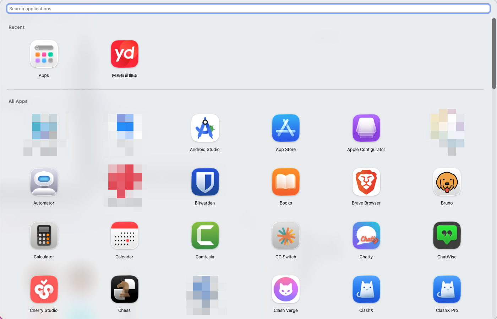
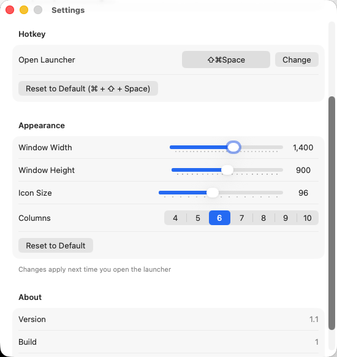

# ApplicationPad

A lightweight Launchpad alternative for macOS.

## Features

- **Quick Launch** - Open with customizable global hotkey (default: `⌘ + ⇧ + Space`)
- **Pinyin Search** - Search apps by name or pinyin initials (e.g., `wy` for 网易云音乐)
- **Recent Apps** - Frequently used apps appear at the top
- **Customizable** - Adjust window size, icon size, and columns count

## Screenshots

## Installation

Download from the [Mac App Store](#) or build from source with Xcode.

## Requirements

- macOS 13.0+
- Accessibility permission (for global hotkey)

## License

MIT
