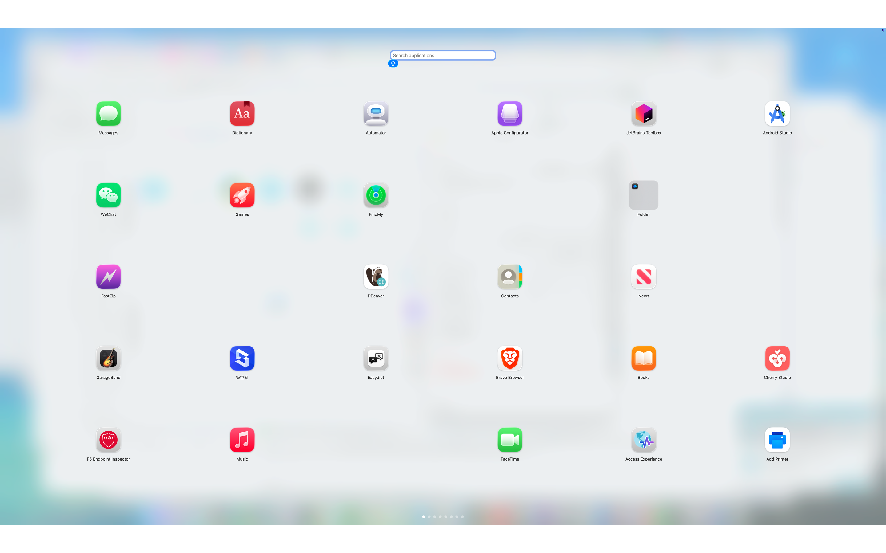
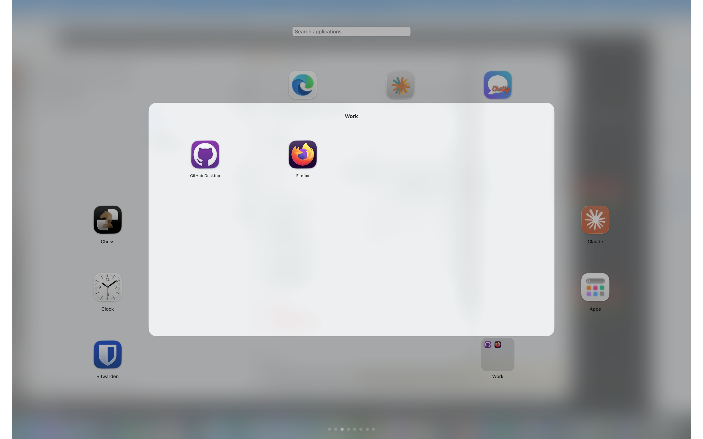
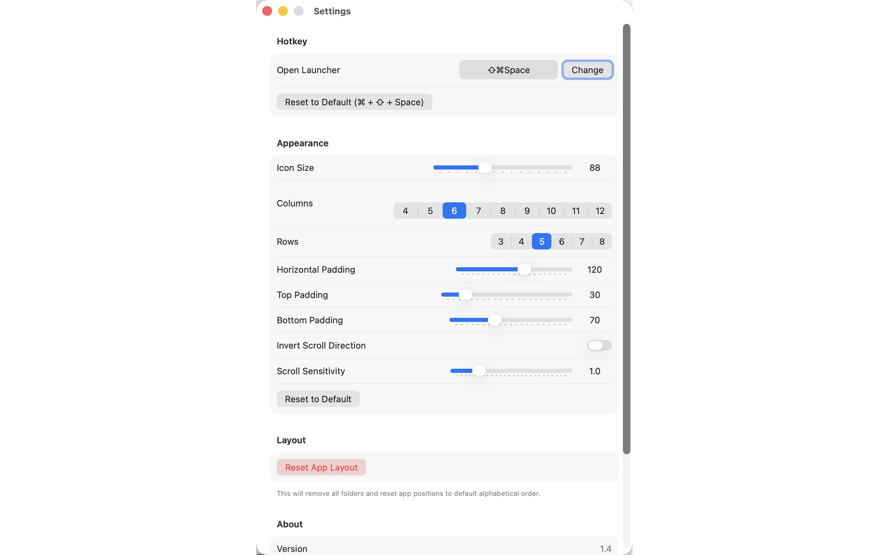

# ApplicationPad

A lightweight Launchpad replacement for macOS. Brings back folder organization, custom app ordering, and more — the app launcher Apple should have built.

Whether Apple removed Launchpad in macOS 26 Tahoe or you simply want a better app launcher, ApplicationPad is the answer.

## Download

**[Download from website](https://applicationpad.cfapps.eu12.hana.ondemand.com)** | **[GitHub Releases](https://github.com/TalentBoys/ApplicationPad/releases)**

## Features

- **Folder Organization** — Create folders to group apps by category
- **Custom App Ordering** — Drag to reorder apps across pages, layout persists between sessions
- **Global Hotkey** — Open instantly with a configurable shortcut (default: `⌘ + ⇧ + Space`)
- **Pinyin Search** — Search apps by name or pinyin initials (e.g., `wy` for 网易云音乐)
- **Recent Apps** — Frequently used apps are automatically prioritized
- **Customizable Layout** — Adjust rows, columns, icon size, and padding
- **Auto-Update** — Built-in Sparkle updates, always stay on the latest version

## Screenshots

## Installation

1. Download the DMG from [Releases](https://github.com/TalentBoys/ApplicationPad/releases) or the [website](https://applicationpad.cfapps.eu12.hana.ondemand.com)
2. Open the DMG and drag ApplicationPad to Applications
3. Launch and grant Accessibility permission when prompted

## Requirements

- macOS 14.0+ (Sonoma, Sequoia, Tahoe)
- Apple Silicon & Intel
- Accessibility permission (for global hotkey)

## Keywords

Launchpad, Launchpad replacement, Launchpad alternative, bring back Launchpad, macOS app launcher, macOS 26 Tahoe, macOS Sequoia, app organizer

## License

MIT
